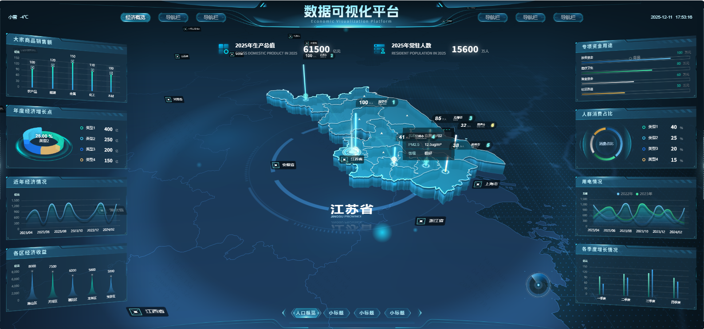

# gpdata-map

基于 `Vue 3 + Vite + Three.js` 的数据可视化大屏项目，包含平面地图场景和地球引导场景两套视图。


## 预览


## 功能概览
- 平面地图视图：全国地图展示、区域下钻、飞线和标签动画。
- 地球视图：地球飞线引导过渡、云层叠加、与地图场景切换。
- 左右统计面板：基于 ECharts 的多个业务图表组件。
- 大屏自适配：基于 `autofit.js` 的 1920x1080 设计稿适配。

## 技术栈
- `Vue 3`
- `Vite 4`
- `Three.js 0.161.0`
- `ECharts 5`
- `GSAP 3`
- `d3-geo`

## 环境要求
- `Node.js >= 18`（推荐）
- `npm / pnpm / yarn` 任一即可，建议一个分支只用一种包管理器，避免锁文件冲突。

## 快速开始
```bash
npm install
npm run dev
```

开发地址：`http://0.0.0.0:3000`

## 常用命令
```bash
npm run dev      # 启动开发服务
npm run build    # 生产构建（输出 dist/）
npm run preview  # 本地预览构建结果
```

## 路由
- `/#/`：平面地图大屏
- `/#/globe`：地球引导大屏

## 目录结构
```text
src/
  main.js                      # 应用入口
  router/index.js              # 路由配置
  views/
    map/                       # 平面地图视图
    globe/                     # 地球引导视图
  mini3d/                      # 3D 引擎封装（core/components/utils/shader/plugins）
  components/                  # 通用 UI 组件
public/
  assets/json/                 # GeoJSON 数据（中国/江苏/世界）
  draco/                       # Draco 解码器
```

## 核心配置入口
- `src/views/map/config.js`：平面地图页面文案、布局和场景参数。
- `src/views/globe/config/viewConfig.js`：地球页面文案和布局配置。
- `src/views/globe/config/worldOptions.js`：地球页地图场景参数（中心点、镜头、云层等）。
- `src/views/globe/config/introTransitionConfig.js`：地球飞线引导动画参数。

## 地图数据说明
- 当前内置数据：`public/assets/json/world.json`、`public/assets/json/中华人民共和国.json`、`public/assets/json/江苏省.json`、`public/assets/json/江苏省-轮廓.json`。
- 下钻逻辑优先读取本地 `public/assets/json/areas_v3/bound/<adcode>.json` 或 `<adcode>_full.json`。
- 若本地下钻数据不存在，会尝试远程源 `geo.datav.aliyun.com`，离线环境建议预置本地 `areas_v3` 数据。

## 构建与部署说明
- Vite `base` 当前固定为 `./`（见 `vite.config.js`），适合静态部署。
- 构建输出文件名包含时间戳，便于缓存更新。

## 已知限制
- 平面地图页当前未在卸载时显式关闭 `autofit`，频繁切换页面时建议补充清理。
- `mini3d` 尺寸监听使用了匿名 `resize` 回调，若重复创建/销毁场景，建议加可移除监听函数以避免潜在泄漏。
