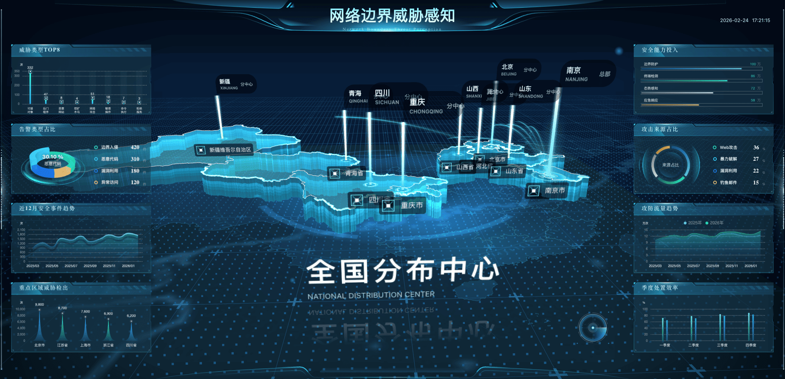
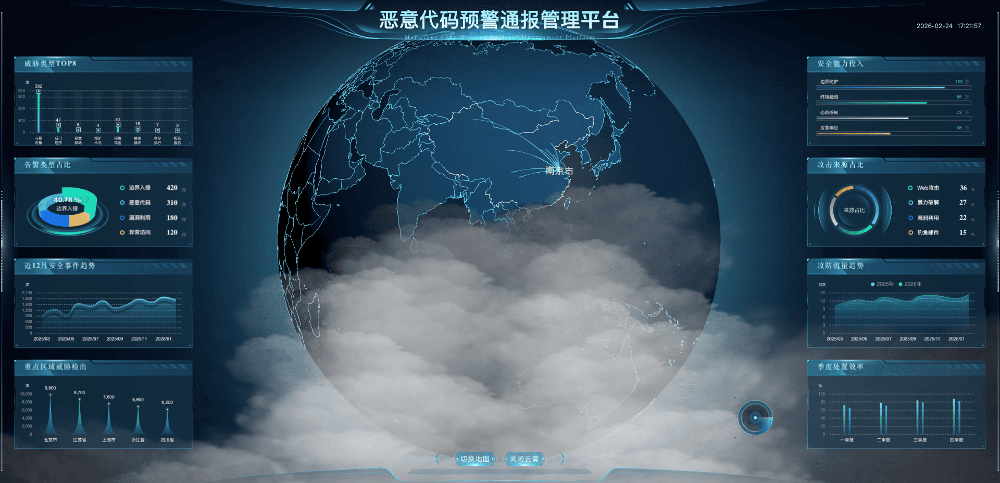

# gpdata-analyse-client

基于 `Vue 3 + Vite + Three.js` 的可视化平台前端，采用「后台管理壳 + 全屏大屏子路由」架构。  
当前包含登录鉴权、角色权限、多页签布局系统，以及地图/地球两套 3D 大屏。


## 预览


<p align="center">
  
  
</p>

## 技术栈

- `Vue 3` + `Vue Router 4` + `Pinia`
- `Vite 4`
- `Three.js 0.161.0` + `three.interactive`
- `ECharts 5` + `vue-echarts`
- `GSAP 3` + `d3-geo`
- `Tailwind CSS` + `shadcn-vue` + `reka-ui`
- `autofit.js`（1920x1080 大屏适配）

## 快速开始

```bash
pnpm install
pnpm run dev
```

开发地址：`http://0.0.0.0:3000`

常用命令：

```bash
pnpm run dev      # 启动开发服务
pnpm run build    # 生产构建（输出 dist/）
pnpm run preview  # 本地预览构建结果
```

## 账号与权限（本地 Mock）

登录实现位于 `src/store/modules/user.js`：

- 管理员：`admin / admin`
- 业务用户：`user / user`

路由权限：

- `MapScreen`（`/visualization/map`）：`roles: ["*"]`
- `GlobeScreen`（`/visualization/globe`）：`roles: ["admin"]`

## 路由结构

- `/#/login`：登录页
- `/#/dashboard/overview`：默认首页
- `/#/visualization/screens`：大屏选择页
- `/#/visualization/map`：中国地图大屏
- `/#/visualization/globe`：地球飞线大屏（管理员）
- `/#/map`、`/#/globe`：兼容入口，分别重定向到 `visualization` 子路由

## 项目结构

```text
src/
  main.js
  router/                       # 路由模块与守卫
  layout/                       # 后台壳（Navbar / Menu / Tab / PageLayout）
  store/                        # Pinia（app/user/tab-bar）
  views/
    login/
    visualization/
      index.vue                 # 大屏入口页
      map/                      # 中国地图大屏
      globe/                    # 地球飞线大屏
    shared/                     # map/globe 共享常量、配置工厂、工具
  mini3d/                       # 3D 引擎封装（core/components/utils/shader/plugins）
  components/
public/
  assets/json/                  # GeoJSON 数据
  draco/                        # Draco 解码器
```

## 架构要点

- 认证与授权：`src/router/guard/` + 路由 `meta.roles`
- 布局系统：`src/layout/default-layout.vue`（支持全屏 `hideLayout`）
- 多页签缓存：`src/components/tab-bar/` + `src/store/modules/tab-bar.js`
- 主题系统：浅色/深色/跟随系统（`src/utils/theme.js`）
- 菜单系统：按路由与权限生成（`src/components/app-menu/use-menu-tree.js`）
- 3D 业务分层：场景逻辑在 `views/visualization/*`，通用能力在 `src/mini3d/`

## 大屏配置入口

地图大屏：

- `src/views/visualization/map/config.js`
- `src/views/visualization/map/skin/index.js`
- `src/views/visualization/map/skin/presets.js`
- `src/views/visualization/map/assets.js`
- `src/views/visualization/map/map.js`

地球大屏：

- `src/views/visualization/globe/config/viewConfig.js`
- `src/views/visualization/globe/config/worldOptions.js`
- `src/views/visualization/globe/config/introTransitionConfig.js`
- `src/views/visualization/globe/assets.js`
- `src/views/visualization/globe/map.js`

## 地图数据说明

内置数据：

- `public/assets/json/world.json`
- `public/assets/json/中华人民共和国.json`
- `public/assets/json/江苏省.json`
- `public/assets/json/江苏省-轮廓.json`

下钻优先读取本地：

- `public/assets/json/areas_v3/bound/<adcode>.json`
- `public/assets/json/areas_v3/bound/<adcode>_full.json`

本地缺失时回退：

- `https://geo.datav.aliyun.com/areas_v3/bound/<adcode>.json`
- `https://geo.datav.aliyun.com/areas_v3/bound/<adcode>_full.json`

## 开发与构建约定

- 代码风格：2 空格、双引号、优先 `<script setup>`
- 导入约定：优先 `@` 别名（`@ -> src`）
- 当前无自动化测试，提交前至少执行 `pnpm run build`
- `vite.config.js` 的 `base` 为 `./`，适合静态部署
